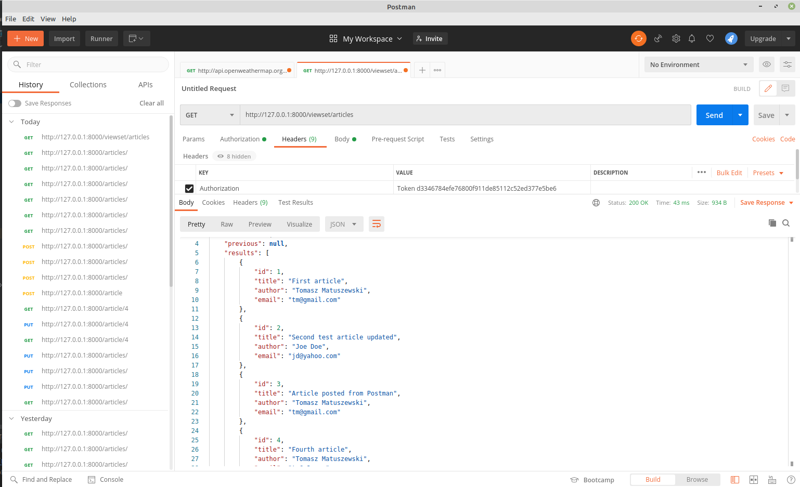
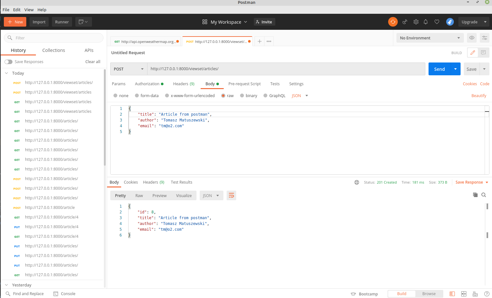
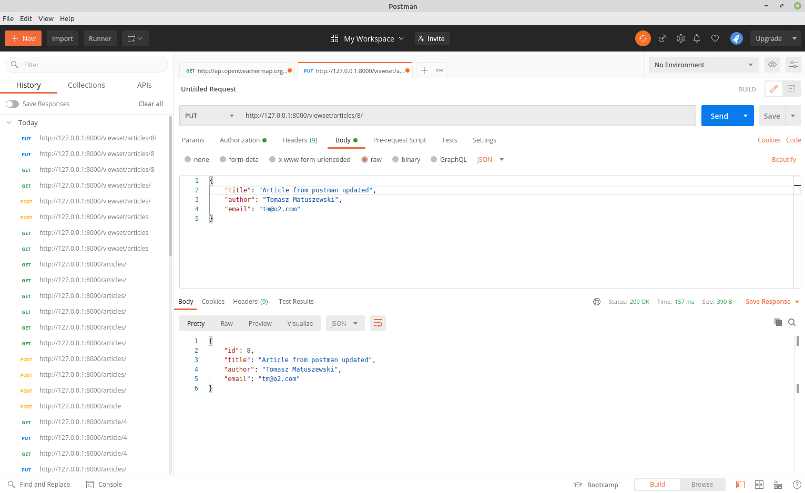
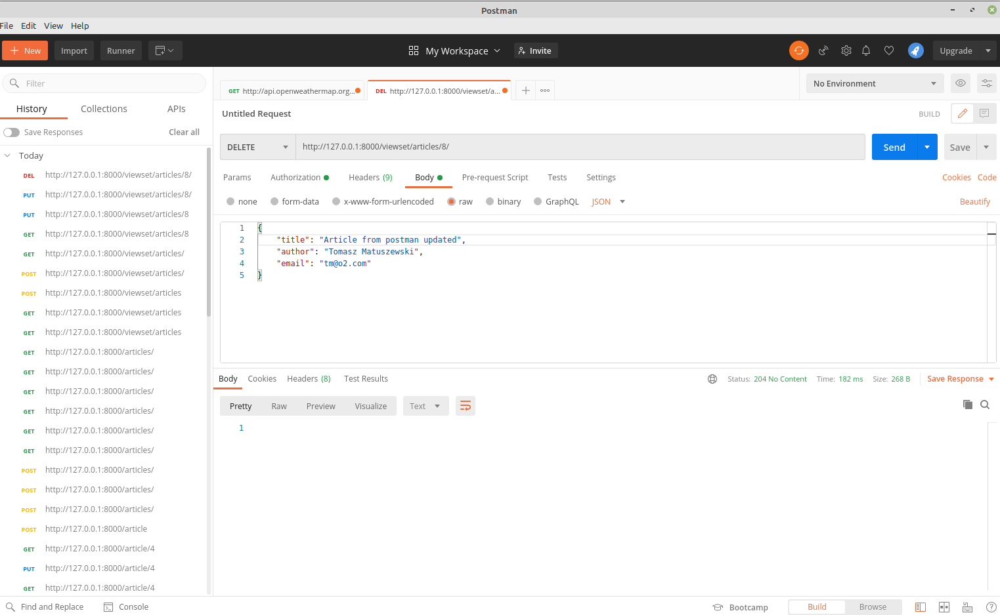
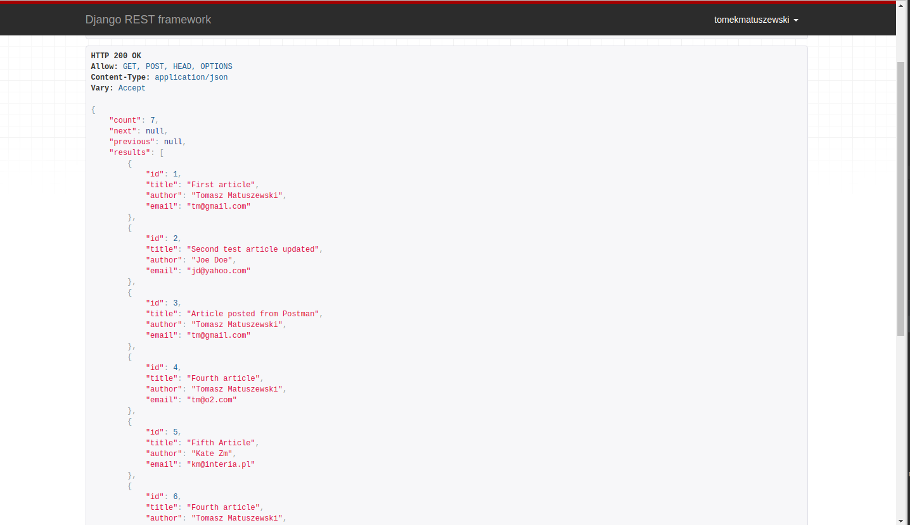

## Django Rest Framwork - Create Simple API

Based on [DjangoRestFramework](https://www.django-rest-framework.org/tutorial/quickstart/)

Api Root

    http://localhost:8000/viewset/articles
    
Testing in Postman with TOKEN authorization
 
GET

 
 
POST

 
 
 
PUT

 
 
DELETE

 
 
 Rest API View
 
  
 